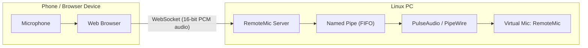

# RemoteMic

Use your phone (or any browser device) as a high-quality wireless microphone for your Linux PC.

## Why

Laptop microphones are often low quality. RemoteMic lets you use your phone’s microphone as a virtual system input on your Linux machine over WiFi—no cables required.

---

## How It Works



### Architecture Overview

1. The **RemoteMic server** runs on your Linux PC.
2. It creates a **virtual microphone source** using PulseAudio (`module-pipe-source`) or PipeWire compatibility.
3. A browser device connects via **WebSocket** over the network.
4. The browser captures microphone audio using the Web Audio API.
5. Audio is streamed as **16-bit PCM (mono or stereo)** to the server.
6. The server writes audio into a **named pipe (FIFO)**.
7. PulseAudio/PipeWire exposes it as an input device: **RemoteMic**.

---

## Requirements

### Linux PC

- Linux with PulseAudio or PipeWire (PulseAudio-compatible)
- `pactl` (from `pulseaudio-utils`)

### Browser Device

- Modern browser (Chrome, Firefox, Safari, etc.)
- Microphone permission enabled
- HTTPS connection (required for mic access in most browsers)

---

## Installation

### From Prebuilt Binary

```bash
curl -L https://github.com/goldpulpy/RemoteMic/releases/latest/download/remotemic -o remotemic
chmod +x remotemic
sudo mv remotemic /usr/local/bin/remotemic
```

> Alternatively, if you prefer `wget`:

```bash
wget https://github.com/goldpulpy/RemoteMic/releases/latest/download/remotemic
chmod +x remotemic
sudo mv remotemic /usr/local/bin/remotemic
```

---

### Build from Source

```bash
make release
chmod +x ./target/x86_64-unknown-linux-musl/release/remotemic
sudo mv ./target/x86_64-unknown-linux-musl/release/remotemic /usr/local/bin/remotemic
```

---

## Usage

### 1. Start the Server

```bash
remotemic
```

By default, it starts on a random available port.

To specify a port:

```bash
remotemic -p 9000
```

On startup, RemoteMic will:

- Verify `pactl` is available
- Check required audio libraries
- Create a virtual microphone named **RemoteMic**
- Start the HTTP + WebSocket server

---

### 2. Select Microphone on Linux

Open your system sound settings:

- Go to **Settings → Sound → Input**
- Select **RemoteMic** as the active input device

You can verify with:

```bash
pactl list short sources
```

---

### 3. Expose to Other Devices (Remote Access)

Create a secure tunnel:

Example using localtunnel:

```bash
npx localtunnel --port <port>
```

This will generate a URL like:

```
https://your-tunnel.loca.lt
```

You can also use alternatives like:

- ngrok
- Cloudflare Tunnel

> [!WARNING]
> Microphone access requires HTTPS.

---

### 4. Connect from Your Phone

1. Open the tunnel URL in your phone browser
2. Tap **Connect**
3. Grant microphone permissions
4. Audio will stream live to your Linux PC

---

## Features

- **Phone-as-mic streaming over WiFi**
- **Single active client** (prevents audio conflicts)
- **Mute toggle** (pause streaming without disconnecting)
- **Live audio level meter**
- **Graceful shutdown and cleanup**
- **Real-time connection logs in terminal**

---

## Audio Format

- Codec: Raw PCM
- Bit depth: 16-bit signed integer
- Channels: Mono (default) / configurable stereo
- Transport: WebSocket
- Typical sample rate: 44.1kHz or 48kHz (browser-dependent)

---

## Troubleshooting

### pactl not found

```bash
# Ubuntu / Debian
sudo apt install pulseaudio-utils

# Fedora
sudo dnf install pulseaudio-utils

# Arch
sudo pacman -S libpulse
```

---

### Required audio libraries missing

```bash
# Ubuntu / Debian
sudo apt install libpulse0 libasound2

# Fedora
sudo dnf install pulseaudio-libs alsa-lib

# Arch
sudo pacman -S libpulse alsa-lib
```

---

### RemoteMic not showing in input devices

```bash
pactl list short sources
```

If missing:

- Restart PulseAudio / PipeWire
- Restart RemoteMic server

---

### No audio coming through

Check:

- Correct input device selected in system settings
- Browser microphone permission granted
- Phone tab is actively connected (not background-suspended)
- Refresh browser page and reconnect

---

## Security Note

When exposed via public tunnel URLs, anyone with the link can potentially connect and stream audio.

Use trusted tunnels and avoid sharing URLs publicly unless protected.

---

## License

MIT License — see [LICENSE](LICENSE) for details.
