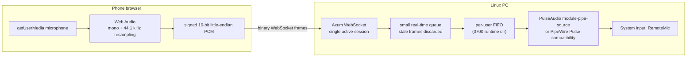

# RemoteMic

Use a device with a higher-quality microphone as a virtual microphone on your Linux PC.

## Why

Laptop microphones are often low quality. RemoteMic lets you use your phone’s microphone as a virtual system input on your Linux machine over WiFi-no cables required.

---

## How It Works


```mermaid
flowchart LR
    subgraph Phone["Phone browser"]
        Mic["getUserMedia microphone"]
        WebAudio["Web Audio\nmono + 44.1 kHz resampling"]
        PCM["signed 16-bit little-endian PCM"]
        Mic --> WebAudio --> PCM
    end

    subgraph PC["Linux PC"]
        Session["Axum WebSocket\nsingle active session"]
        Queue["small real-time queue\nstale frames discarded"]
        Pipe["per-user FIFO\n(0700 runtime dir)"]
        Module["PulseAudio module-pipe-source\nor PipeWire Pulse compatibility"]
        Source["System input: RemoteMic"]
        Session --> Queue --> Pipe --> Module --> Source
    end

    PCM -- "binary WebSocket frames" --> Session
```

### Architecture Overview

1. RemoteMic loads PulseAudio's `module-pipe-source` (also provided by
   PipeWire's PulseAudio compatibility layer). The module reads a mono,
   44.1 kHz `s16le` stream from a per-user FIFO (kept in
   `$XDG_RUNTIME_DIR/remotemic` with `0700` permissions, falling back to
   `$TMPDIR/remotemic-<uid>`) and exposes the **RemoteMic** system input.
2. After **Connect microphone** is tapped, the page opens one WebSocket session
   and asks the browser for a mono microphone stream with `getUserMedia`.
3. Web Audio supplies floating-point samples. The page resamples them to
   44.1 kHz when necessary, converts them to signed 16-bit little-endian PCM,
   and sends binary WebSocket frames.
4. The server accepts one client at a time. It tags frames with the current
   session, uses a deliberately small bounded queue, drops frames rather than
   accumulating latency when the output stalls, and rejects frames left by a
   disconnected session.
5. A long-running writer feeds current-session frames into the FIFO for the
   virtual source.

---

## Requirements

### Linux PC

- Linux with PulseAudio or PipeWire (PulseAudio-compatible)
- `pactl` (from `pulseaudio-utils`)

### Browser Device

- Modern browser (Chrome, Firefox, Safari, etc.)
- Microphone permission enabled
- HTTPS connection (required for mic access in most browsers)

---

## Installation

### From Prebuilt Binary

```bash
curl -L https://github.com/goldpulpy/RemoteMic/releases/download/latest/remotemic -o remotemic
chmod +x remotemic
sudo mv remotemic /usr/local/bin/remotemic
```

> Alternatively, if you prefer `wget`:

```bash
wget https://github.com/goldpulpy/RemoteMic/releases/download/latest/remotemic
chmod +x remotemic
sudo mv remotemic /usr/local/bin/remotemic
```

---

### Build from Source

```bash
make release
chmod +x ./target/x86_64-unknown-linux-musl/release/remotemic
sudo mv ./target/x86_64-unknown-linux-musl/release/remotemic /usr/local/bin/remotemic
```

---

## Usage

### 1. Start the Server

```bash
remotemic
```

By default, it starts on a random available port.

To specify a port:

```bash
remotemic -p 9000
```

On startup, RemoteMic will:

- Verify `pactl` is available
- Check required audio libraries
- Create a virtual microphone named **RemoteMic**
- Start the HTTP + WebSocket server

---

### 2. Select Microphone on Linux

Open your system sound settings:

- Go to **Settings → Sound → Input**
- Select **RemoteMic** as the active input device

You can verify with:

```bash
pactl list short sources
```

---

### 3. Expose to Other Devices (Remote Access)

Create a secure tunnel:

Example using localtunnel:

```bash
npx localtunnel --port <port>
```

This will generate a URL like:

```
https://your-tunnel.loca.lt
```

You can also use alternatives like:

- ngrok
- Cloudflare Tunnel

> [!WARNING]
> Microphone access requires HTTPS.

---

### 4. Connect from Your Phone

1. Open the tunnel URL in your phone browser
2. Tap **Connect microphone**
3. Grant microphone permissions
4. Keep the page visible while audio streams to your Linux PC

**Mute** pauses PCM transmission but keeps the microphone, WebSocket, and
virtual-source session alive, so unmuting is immediate. **Disconnect
microphone** stops the browser tracks, closes the audio graph and WebSocket,
releases the screen wake lock, and makes the server slot available for the next
connection. A fast reconnect waits briefly for the previous WebSocket close so
callbacks from the old session cannot tear down the new one.

---

## Features

- **Phone-as-mic streaming over WiFi**
- **Single active client** (prevents audio conflicts)
- **Mute toggle** (pause streaming without disconnecting)
- **Live audio level meter**
- **Screen Wake Lock while connected**, with a clear fallback when unsupported
- **Reconnect-safe session cleanup** with stale audio rejection
- **Graceful shutdown and cleanup**
- **Real-time connection logs in terminal**

---

## Audio Format

- Codec: Raw PCM
- Sample encoding: signed 16-bit little-endian (`s16le`)
- Channels: 1 (mono)
- Sample rate: 44,100 Hz (browser input is resampled when needed)
- Transport: WebSocket

---

## Troubleshooting

### pactl not found

```bash
# Ubuntu / Debian
sudo apt install pulseaudio-utils

# Fedora
sudo dnf install pulseaudio-utils

# Arch
sudo pacman -S libpulse
```

---

### Required audio libraries missing

```bash
# Ubuntu / Debian
sudo apt install libpulse0 libasound2

# Fedora
sudo dnf install pulseaudio-libs alsa-lib

# Arch
sudo pacman -S libpulse alsa-lib
```

---

### RemoteMic not showing in input devices

```bash
pactl list short sources
```

If missing:

- Restart PulseAudio / PipeWire
- Restart RemoteMic server

---

### No audio coming through

Check:

- Correct input device selected in system settings
- Browser microphone permission granted
- Phone tab is actively connected (not background-suspended)
- Refresh browser page and reconnect

### Streaming stops when the phone sleeps

RemoteMic requests the Screen Wake Lock API for each active connection and
requests it again when the page becomes visible after being backgrounded. If
the browser does not support wake lock or refuses it, the page shows a warning;
leave the page visible and keep the screen on manually.

On iOS Safari, wake lock can prevent the normal automatic screen timeout on
supported versions, but a web page cannot guarantee continued microphone
capture after you manually lock the phone. Do not press the lock button while
streaming.

---

## Security Note

When exposed via public tunnel URLs, anyone with the link can potentially connect and stream audio.

Use trusted tunnels and avoid sharing URLs publicly unless protected.

---

## License

MIT License — see [LICENSE](LICENSE) for details.
