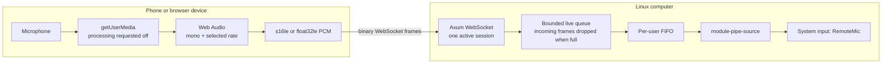

# RemoteMic

Use a phone or another browser-equipped device as a real-time virtual
microphone on a Linux computer.

RemoteMic captures audio with the browser, sends uncompressed PCM over a
WebSocket, and exposes it through PulseAudio or PipeWire Pulse compatibility as
a system input named **RemoteMic**. Applications such as OBS, Discord, a DAW,
or a browser can then select it like any other microphone.

## Highlights

- Uncompressed PCM transport; no MP3, AAC, or Opus encoding
- Low-bandwidth, standard, and high-quality audio presets
- PulseAudio and PipeWire Pulse compatibility
- One active sender at a time, preventing mixed sessions
- Bounded real-time queues that cap backlog and latency growth
- Mute, live level meter, wake lock, and reconnect-safe cleanup
- A single Rust binary with the web interface embedded in it

## Audio quality

RemoteMic has three quality presets:

| Preset     | Sample rate | Wire format                     | Channels | Raw payload | Recommended use            |
| ---------- | ----------: | ------------------------------- | -------: | ----------: | -------------------------- |
| `low`      |   16,000 Hz | signed 16-bit little-endian PCM |        1 |     32 kB/s | speech on slower networks  |
| `standard` |   44,100 Hz | signed 16-bit little-endian PCM |        1 |   88.2 kB/s | speech, calls, general use |
| `high`     |   48,000 Hz | 32-bit float little-endian PCM  |        1 |    192 kB/s | video, music, editing      |

<details>
<summary><strong>What these formats mean and what “high quality” guarantees</strong></summary>

Payload figures exclude WebSocket, TLS, and tunnel overhead. All modes are
mono because browser microphone capture commonly exposes a single channel.

Low mode keeps the speech-relevant frequency range while reducing the raw
audio payload by about 64% compared with standard mode and 83% compared with
high mode. It is intended for speech, not music or high-fidelity recording.

The high-quality mode keeps Web Audio's floating-point samples as `float32le`
through the RemoteMic pipeline. This avoids RemoteMic's 16-bit conversion and
uses 48 kHz, the rate commonly used by phones and video software. It is not a
guarantee of bit-perfect access to the phone's microphone hardware: the device,
operating system, or browser may still apply processing before Web Audio sees
the signal.

RemoteMic requests that browser echo cancellation, noise suppression, and
automatic gain control be disabled. Browsers are allowed to ignore those
constraints. If the browser cannot create an audio context at the selected
rate, RemoteMic resamples the captured signal to that rate.

> [!NOTE]
> The stream is raw PCM, not a WAV file. WAV is a container and would not, by
> itself, improve the audio samples transported by RemoteMic.

</details>

## How it works

<details>
<summary><strong>Show the architecture and real-time audio path</strong></summary>


```mermaid
flowchart LR
    subgraph Device["Phone or browser device"]
        Mic["Microphone"]
        Capture["getUserMedia\nprocessing requested off"]
        WebAudio["Web Audio\nmono + selected rate"]
        PCM["s16le or float32le PCM"]
        Mic --> Capture --> WebAudio --> PCM
    end

    subgraph Linux["Linux computer"]
        WS["Axum WebSocket\none active session"]
        Queue["Bounded live queue\nincoming frames dropped when full"]
        FIFO["Per-user FIFO"]
        Pulse["module-pipe-source"]
        Input["System input: RemoteMic"]
        WS --> Queue --> FIFO --> Pulse --> Input
    end

    PCM -- "binary WebSocket frames" --> WS
```

The data path is:

1. At startup, RemoteMic loads PulseAudio's `module-pipe-source`. PipeWire users
   get the same interface through `pipewire-pulse`.
2. The module reads the selected mono PCM format from a FIFO and publishes the
   **RemoteMic** source.
3. The web page opens a token-protected WebSocket and asks the browser for
   microphone access only after the user presses **Connect microphone**.
4. Web Audio emits floating-point samples. Low and standard modes convert them
   to `s16le`; high mode keeps them as `float32le`.
5. The server passes current-session frames into the FIFO without applying an
   audio codec, gain, filtering, or mixing.

The FIFO is stored in `$XDG_RUNTIME_DIR/remotemic` when available. Otherwise,
RemoteMic uses `$TMPDIR/remotemic-<uid>`. Its parent directory is created with
mode `0700`.

### Real-time behavior

RemoteMic is designed as a live microphone, not as a lossless recorder. The
browser stops adding data when its WebSocket backlog grows too large, and the
server uses a queue of eight audio frames. When either side cannot keep up,
incoming audio frames are discarded until the backlog recovers. This prevents
latency from growing indefinitely, but severe network or system stalls can
produce audible gaps.

The Web Audio callback is 1,024 samples in low mode and 4,096 samples in the
other modes. That represents approximately 64 ms in low mode, 93 ms in
standard mode, and 85 ms in high mode. Network, tunnel, browser, and system
audio buffering add further latency.

</details>

## Requirements

<details>
<summary><strong>Show system and browser requirements</strong></summary>

### Linux computer

- Linux
- PulseAudio, or PipeWire with `pipewire-pulse`
- `pactl`, normally provided by `pulseaudio-utils` or the distribution's
  PulseAudio client package
- `libpulse.so.0` and `libasound.so.2`

### Sending device

- A modern browser with `getUserMedia` and Web Audio support
- Microphone permission
- An HTTPS page, except when accessing `localhost`
- A stable network connection

Screen Wake Lock support is helpful but not required. If it is unavailable,
the page asks the user to keep the screen awake manually.

</details>

## Installation

<details open>
<summary><strong>Install a prebuilt binary</strong></summary>

Download the latest binary:

```bash
curl -L https://github.com/goldpulpy/RemoteMic/releases/latest/download/remotemic -o remotemic
chmod +x remotemic
sudo mv remotemic /usr/local/bin/remotemic
```

With `wget`:

```bash
wget https://github.com/goldpulpy/RemoteMic/releases/latest/download/remotemic
chmod +x remotemic
sudo mv remotemic /usr/local/bin/remotemic
```

</details>

<details>
<summary><strong>Build from source</strong></summary>

The project uses Rust 2024 edition. A normal native build is:

```bash
git clone https://github.com/goldpulpy/RemoteMic.git
cd RemoteMic
cargo build --release
./target/release/remotemic --help
```

To produce the statically linked `x86_64-unknown-linux-musl` artifact configured
by the Makefile, install the musl Rust target, a musl toolchain, and `objcopy`,
then run:

```bash
rustup target add x86_64-unknown-linux-musl
make release
./target/x86_64-unknown-linux-musl/release/remotemic --help
```

</details>

## Command-line options

<details>
<summary><strong>Show the complete CLI reference and examples</strong></summary>

```text
Usage: remotemic [OPTIONS]

Options:
  -p, --port <PORT>          Listen on this port (default: random)
  -q, --quality <QUALITY>    low: 16 kHz/16-bit
                             standard: 44.1 kHz/16-bit (default)
                             high: 48 kHz/32-bit float
  -h, --help                 Print help
```

With no arguments, RemoteMic selects a random available port in the dynamic
port range and uses standard quality:

```bash
remotemic
```

Choose a fixed port:

```bash
remotemic --port 9000
```

Enable high quality:

```bash
remotemic --quality high
```

Use the low-bandwidth speech profile:

```bash
remotemic --quality low
```

Combine both options:

```bash
remotemic --port 9000 --quality high
```

On startup, the terminal shows the selected audio format, local URL, and
connection events. Stop RemoteMic with `Ctrl+C`; it will unload the virtual
source and remove its FIFO.

</details>

## Quick start

### 1. Start RemoteMic

```bash
remotemic --port 9000 --quality high
```

For speech over a slower network, use `--quality low`.

### 2. Make the page available over HTTPS

Microphone capture is restricted to secure browser contexts. A public tunnel
is one convenient way to obtain an HTTPS URL. Choose one of the options below.

<details open>
<summary><strong>LocalTunnel — quickest option with Node.js</strong></summary>

LocalTunnel is convenient when Node.js and npm are already installed. It does
not require an account for a temporary randomly assigned URL:

```bash
npx localtunnel --port 9000
```

The command prints a public `https://...loca.lt` address. The URL remains active
while the command is running. See the
[LocalTunnel documentation](https://github.com/localtunnel/localtunnel#readme)
for installation and optional subdomain settings.

</details>

<details>
<summary><strong>Cloudflare Quick Tunnel — no account or domain required</strong></summary>

After installing `cloudflared`, a temporary Quick Tunnel can be started without
a Cloudflare account or domain:

```bash
cloudflared tunnel --url http://localhost:9000
```

The command prints a random `https://...trycloudflare.com` address. Quick
Tunnels are intended for testing and temporary use. For a stable hostname,
create a managed Cloudflare Tunnel and map a domain to
`http://localhost:9000`. See the official
[Cloudflare Tunnel guide](https://developers.cloudflare.com/tunnel/get-started/).

</details>

<details>
<summary><strong>ngrok — managed endpoints and access controls</strong></summary>

ngrok requires installing its agent, creating an account, and adding the
account's authtoken once:

```bash
ngrok config add-authtoken <your-authtoken>
ngrok http 9000
```

The second command prints an HTTPS forwarding address. ngrok also offers
managed endpoints and access-control features; availability depends on the
account plan. See the official
[ngrok setup guide](https://ngrok.com/use-cases/share-localhost).

</details>

#### Tunnel comparison

| Option | Account required | Typical command | Best suited for |
| --- | --- | --- | --- |
| LocalTunnel | No | `npx localtunnel --port 9000` | fastest setup with Node.js |
| Cloudflare Quick Tunnel | No | `cloudflared tunnel --url http://localhost:9000` | temporary testing with a standalone client |
| ngrok | Yes | `ngrok http 9000` | managed endpoints and access controls |

Open the generated HTTPS address on the phone. Keep both RemoteMic and the
tunnel process running for the entire session. A tunnel relays the uncompressed
audio stream through an external service, so geographic distance, provider
congestion, and service limits can affect latency and reliability. A trusted
HTTPS reverse proxy on the local network will usually provide lower latency.

> [!WARNING]
> RemoteMic does not provide TLS itself. Opening `http://<computer-ip>:9000`
> from a phone normally will not allow microphone access because it is not a
> secure context. A tunnel URL is public unless the provider is configured with
> access controls. Stop the tunnel after use and do not share its URL.

### 3. Connect the phone

1. Open the HTTPS URL.
2. Press **Connect microphone**.
3. Grant microphone permission.
4. Keep the page visible and the phone awake.

**Mute** stops sending PCM while keeping the browser microphone, WebSocket, and
virtual-source session ready for immediate unmute. **Disconnect microphone**
stops the browser tracks, closes the audio graph and WebSocket, releases the
wake lock, and allows another device to connect.

### 4. Select the virtual microphone

In the Linux sound settings or the recording application, select
**RemoteMic** as the input device.

Verify that the source exists:

```bash
pactl list short sources
```

Inspect its negotiated details:

```bash
pactl list sources
```

## Choosing a quality mode

<details>
<summary><strong>When to use low, standard, or high</strong></summary>

Use `low` when:

- the content is speech rather than music;
- the tunnel or network is bandwidth-constrained;
- standard mode produces gaps or dropped-frame warnings;
- reduced bandwidth matters more than high-frequency detail.

Use `standard` when:

- the microphone is used for calls, chat, or speech recognition;
- lower bandwidth matters;
- the connection is unreliable;
- maximum compatibility is preferred.

Use `high` when:

- recording video at 48 kHz;
- recording music or material that will be processed later;
- avoiding RemoteMic's float-to-16-bit conversion matters;
- the network and receiving software can comfortably handle the larger stream.

High mode improves the format inside RemoteMic but cannot restore information
already removed by the phone or browser. For critical music recording, consider
recording locally on the phone as well; a local recording is not vulnerable to
network frame drops.

</details>

## Security model

<details>
<summary><strong>What is protected and what becomes public</strong></summary>

- The server listens on `0.0.0.0`, so the chosen port is reachable through any
  network interface allowed by the computer's firewall.
- Each server run generates a random session token, embeds it in the served
  page, and requires it for the WebSocket upgrade.
- Only one WebSocket client may stream at a time.
- The token is not a substitute for HTTPS or access control. Anyone who can
  open a publicly shared page can obtain it and attempt to connect.
- Audio is encrypted in transit only when the page is delivered through HTTPS
  and the WebSocket therefore uses `wss://`.

Use a trusted tunnel, restrict access where possible, and do not publish the
URL. RemoteMic does not store recordings or intentionally write captured audio
to disk.

</details>

## Troubleshooting

<details>
<summary><strong><code>pactl</code> is not installed</strong></summary>

```bash
# Ubuntu / Debian
sudo apt install pulseaudio-utils

# Fedora
sudo dnf install pulseaudio-utils

# Arch Linux
sudo pacman -S libpulse
```

</details>

<details>
<summary><strong>Required audio libraries are missing</strong></summary>

```bash
# Ubuntu / Debian
sudo apt install libpulse0 libasound2

# Fedora
sudo dnf install pulseaudio-libs alsa-lib

# Arch Linux
sudo pacman -S libpulse alsa-lib
```

</details>

<details>
<summary><strong>The browser says that microphone access requires HTTPS</strong></summary>

Use an HTTPS tunnel or serve the application behind a trusted HTTPS reverse
proxy. A plain LAN address such as `http://192.168.1.10:9000` is not normally a
secure browser context.

</details>

<details>
<summary><strong>RemoteMic is not listed as an input</strong></summary>

Check the source and module lists:

```bash
pactl list short sources
pactl list short modules
```

Restart RemoteMic after confirming that PulseAudio or `pipewire-pulse` is
running. If RemoteMic previously crashed, an old `module-pipe-source` may still
be loaded. Find its numeric module index in the second command and unload that
specific index:

```bash
pactl unload-module <module-index>
```

Then start RemoteMic again.

</details>

<details>
<summary><strong>The page connects, but there is no sound</strong></summary>

- Confirm that **RemoteMic** is selected in the receiving application.
- Confirm that the page says **Streaming audio**, not **Muted**.
- Check the live level meter on the page.
- Verify that the correct microphone permission was granted.
- Make sure another application is not holding the phone microphone
  exclusively.
- Disconnect, refresh the page, and connect again.

</details>

<details>
<summary><strong>The page says another device is connected</strong></summary>

Only one client can stream. Disconnect the current device or wait for its
WebSocket to close, then reconnect. If a browser disappeared without closing
cleanly, refresh the waiting device after a short delay.

</details>

<details>
<summary><strong>Audio has gaps, clicks, or dropped-frame warnings</strong></summary>

- Try `--quality low` to reduce network traffic.
- Prefer a strong local Wi-Fi connection.
- Avoid a distant public tunnel when low latency matters.
- Keep the sending page in the foreground.
- Reduce CPU load on the phone and computer.
- Watch the server logs for `Audio queue full` messages and the browser console
  for dropped-frame warnings.

RemoteMic deliberately drops incoming frames while buffers are backed up, so a
congested connection produces gaps rather than steadily increasing delay.

</details>

<details>
<summary><strong>High-quality mode fails while standard mode works</strong></summary>

The installed PulseAudio or PipeWire compatibility layer may not accept the
`float32le` pipe-source format. Check the `pactl load-module` error printed by
RemoteMic and use `--quality standard` as a compatibility fallback.

</details>

<details>
<summary><strong>Streaming stops when the phone sleeps</strong></summary>

RemoteMic requests Screen Wake Lock and requests it again when the page becomes
visible. Some browsers do not support it, and mobile operating systems may
suspend capture after the phone is manually locked. Leave the page visible,
keep the phone awake, and do not press the lock button while streaming.

</details>

## Current limitations

<details>
<summary><strong>Show current limitations</strong></summary>

- Linux receiver only
- Mono capture only
- One active sending device
- No built-in TLS, authentication UI, or tunnel
- No local or server-side recording
- Browser audio constraints are requests, not hardware guarantees
- Audio frames may be dropped under backpressure to preserve live latency
- Browser background and lock-screen behavior varies by platform

</details>

## Development

<details>
<summary><strong>Show project layout and development commands</strong></summary>

Project layout:

```text
src/main.rs       CLI parsing, startup, shutdown, and FIFO writer
src/audio.rs      audio presets and PulseAudio virtual-source lifecycle
src/server.rs     HTTP/WebSocket server and single-session management
src/page.rs       embedded browser UI and audio capture pipeline
src/preflight.rs  pactl and shared-library checks
```

Useful commands:

```bash
cargo test
cargo fmt --all --check
cargo clippy --all-targets --all-features -- -D warnings
make release
make security
```

The server currently limits WebSocket messages and frames to 64 KiB. Browser
audio chunks are 1,024 or 4,096 samples depending on the profile, so all three
quality presets fit within that limit.

</details>

## License

MIT License — see [LICENSE](LICENSE).
