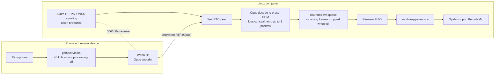

<div align="center">

# 🎙️ RemoteMic

<p><b>Use a phone or another browser-equipped device as a real-time virtual microphone on a Linux computer</b></p>

[](https://www.rust-lang.org/)
[](https://github.com/tokio-rs/axum)
[](https://webrtc.org/)
[](https://www.freedesktop.org/wiki/Software/PulseAudio/)
[](https://github.com/goldpulpy/RemoteMic/actions/workflows/ci.yml)
[](LICENSE)

[English](README.md) · [Русский](README.ru.md)

[🚀 Quick start](#quick-start) · [🎚 Audio quality](#audio-quality) · [🛠 Installation](#installation) · [🔒 Security](#security-model) · [❓ Troubleshooting](#troubleshooting) · [📄 License](#license)

</div>

RemoteMic captures audio in the browser, sends it over WebRTC using Opus, and
exposes it through PulseAudio or PipeWire Pulse compatibility as a system input
named **RemoteMic**. Applications such as OBS, Discord, a DAW, or a browser can
then select it like any other microphone.

RemoteMic serves its own HTTPS interface with a persistent, self-signed local
certificate authority, so no external tunnel is required when both devices are
on the same network.

## ✨ Highlights

- Audio over WebRTC (Opus); the browser encodes, and the server decodes to PCM
- Built-in HTTPS with a persistent local CA; no tunnel needed on a LAN
- Low-bandwidth, standard, and high-quality presets mapped to Opus bitrates
- PulseAudio and PipeWire Pulse compatibility
- One active sender at a time, preventing mixed sessions
- Bounded real-time queue that caps backlog and latency growth
- Live RTT, jitter, packet-loss, and queue metrics on the page
- A single Rust binary with the web interface embedded in it

## 🎚️ Audio quality

RemoteMic has three quality presets:

| Preset     | Server output rate | Pulse format | Opus bitrate | Recommended use                       |
| ---------- | -----------------: | ------------ | -----------: | ------------------------------------- |
| `low`      |          16,000 Hz | `s16le`      |      48 kb/s | speech on slower or constrained links |
| `standard` |          24,000 Hz | `s16le`      |      96 kb/s | speech, calls, general use            |
| `high`     |          48,000 Hz | `float32le`  |     192 kb/s | 48 kHz voice-over and streaming       |

<details>
<summary><strong>What these formats mean and what "high quality" guarantees</strong></summary>

Opus bitrate figures describe the encoded stream between the browser and
RemoteMic. They exclude WebRTC, DTLS, and IP overhead. All modes are mono
because browser microphone capture commonly exposes a single channel.

The browser always captures at 48 kHz and encodes the audio as Opus at the
selected bitrate. The server decodes that stream to the preset output rate and
writes either signed 16-bit little-endian (`s16le`) or 32-bit float
little-endian (`float32le`) PCM to the PulseAudio pipe source.

Opus is a lossy codec. Low mode keeps the speech-relevant frequency range while
reducing network usage by roughly 50% compared with standard mode and 75%
compared with high mode. It is intended for speech, not music or high-fidelity
recording.

The high-quality preset decodes to `float32le` at 48 kHz, the rate commonly
used by phones and video software, and avoids RemoteMic's float-to-16-bit
conversion. It is not a guarantee of bit-perfect access to the phone's
microphone hardware: the device, operating system, or browser may still apply
processing before Web Audio sees the signal, and the signal is still Opus-encoded
in transit.

RemoteMic requests that browser echo cancellation, noise suppression, and
automatic gain control be disabled. Browsers are allowed to ignore those
constraints. The page warns when the captured sample rate or processing flags
differ from the request.

</details>

## ⚙️ How it works

<details>
<summary><strong>Show the architecture and real-time audio path</strong></summary>


```mermaid
flowchart LR
    subgraph Device["Phone or browser device"]
        Mic["Microphone"]
        Capture["getUserMedia\n48 kHz mono, processing off"]
        WebRTC["WebRTC\nOpus encoder"]
        Mic --> Capture --> WebRTC
    end

    subgraph Linux["Linux computer"]
        HTTPS["Axum HTTPS + WSS signaling\ntoken protected"]
        Peer["WebRTC peer"]
        Decode["Opus decode to preset PCM\nloss concealment, up to 3 packets"]
        Queue["Bounded live queue\nincoming frames dropped when full"]
        FIFO["Per-user FIFO"]
        Pulse["module-pipe-source"]
        Input["System input: RemoteMic"]
        HTTPS --> Peer --> Decode --> Queue --> FIFO --> Pulse --> Input
    end

    WebRTC -- "encrypted RTP (Opus)" --> Peer
    HTTPS -. "SDP offer/answer" .- WebRTC
```

The data path is:

1. At startup, RemoteMic generates or reloads a persistent local CA and a
   server certificate, then loads PulseAudio's `module-pipe-source`. PipeWire
   users get the same interface through `pipewire-pulse`.
2. The module reads the selected mono PCM format from a FIFO and publishes the
   **RemoteMic** source.
3. The embedded page opens a token-protected WebSocket and exchanges a WebRTC
   offer and answer. Only host (LAN) ICE candidates are used, so both devices
   must be reachable on the same network.
4. The browser captures 48 kHz mono audio, requests echo cancellation, noise
   suppression, and automatic gain control be disabled, and encodes Opus at the
   selected bitrate.
5. The server receives the encrypted RTP stream, decodes Opus, conceals up to
   three missing packets, and converts the result to the preset PCM format.
6. The server passes current-session frames into the FIFO without applying a
   codec, gain, filtering, or mixing of its own.

The FIFO is stored in `$XDG_RUNTIME_DIR/remotemic` when available; otherwise,
RemoteMic uses `$TMPDIR/remotemic-<uid>`. The local CA is kept across reboots in
`~/.local/share/remotemic`. Both application directories are created with mode
`0700`, and the CA private key is written with mode `0600`.

### ⏱️ Real-time behavior

RemoteMic is designed as a live microphone, not as a lossless recorder. The
server uses a queue of one audio frame by default. When the output cannot keep
up, the oldest queued frame is replaced with the newest one. This prevents
latency from growing indefinitely, but severe network or system stalls can
produce audible gaps.

WebRTC stats provide RTT to the page, while the server tracks jitter, packet
loss, and queue delay. The page polls `/metrics` once per second and displays
all four values.

</details>

## 📋 Requirements

<details>
<summary><strong>Show system and browser requirements</strong></summary>

### 🐧 Linux computer

- Linux
- PulseAudio, or PipeWire with `pipewire-pulse`
- `pactl`, normally provided by `pulseaudio-utils` or the distribution's
  PulseAudio client package
- `libpulse.so.0` and `libasound.so.2`

### 📱 Sending device

- A modern browser with `getUserMedia`, Web Audio, and WebRTC support
- Microphone permission
- The RemoteMic local CA installed as a trusted root (download from the page)
- Layer-3 reachability to the computer, usually the same LAN or a VPN

No public tunnel or internet connection is required for a same-network setup.

</details>

## 📦 Installation

<details open>
<summary><strong>Install a prebuilt binary</strong></summary>

Download the latest binary:

```bash
curl -L https://github.com/goldpulpy/RemoteMic/releases/download/latest/remotemic -o remotemic
chmod +x remotemic
sudo mv remotemic /usr/local/bin/remotemic
```

With `wget`:

```bash
wget https://github.com/goldpulpy/RemoteMic/releases/download/latest/remotemic
chmod +x remotemic
sudo mv remotemic /usr/local/bin/remotemic
```

</details>

<details>
<summary><strong>Build from source</strong></summary>

The project uses Rust 2024 edition. A normal native build is:

```bash
git clone https://github.com/goldpulpy/RemoteMic.git
cd RemoteMic
cargo build --release
./target/release/remotemic --help
```

To produce the statically linked `x86_64-unknown-linux-musl` artifact configured
by the Makefile, install the musl Rust target, a musl toolchain, and `objcopy`,
then run:

```bash
rustup target add x86_64-unknown-linux-musl
make release
./target/x86_64-unknown-linux-musl/release/remotemic --help
```

</details>

## ⌨️ Command-line options

<details>
<summary><strong>Show the complete CLI reference and examples</strong></summary>

```text
Usage: remotemic [OPTIONS]

Options:
  -b, --bind <ADDRESS>       Bind to this IP address (default: 0.0.0.0)
  -p, --port <PORT>          Listen on this port (default: 59152)
  -q, --quality <QUALITY>    low: 16 kHz/16-bit
                             standard: 24 kHz/16-bit (default)
                             high: 48 kHz/32-bit float
  -n, --source-name <NAME>   PulseAudio source name (default: RemoteMic)
      --queue-size <FRAMES>  Buffered audio frames, 1-1024 (default: 1)
  -l, --log-level <LEVEL>    error, warn, info, debug, or trace (default: info)
  -h, --help                 Print help
  -V, --version              Print version
```

With no arguments, RemoteMic listens on port `59152` and uses standard quality:

```bash
remotemic
```

Choose a fixed port:

```bash
remotemic --port 9000
```

Enable high quality:

```bash
remotemic --quality high
```

Use the low-bandwidth speech profile:

```bash
remotemic --quality low
```

Combine both options:

```bash
remotemic --port 9000 --quality high
```

Listen only on the local computer instead of every network interface:

```bash
remotemic --bind 127.0.0.1 --port 9000
```

Choose the PulseAudio/PipeWire source name shown to audio applications:

```bash
remotemic --source-name studio_mic
```

Source names may contain ASCII letters, digits, `.`, `-`, and `_`.

Increase the bounded audio queue when short scheduling stalls cause gaps. A
larger queue can absorb longer stalls, but it can also add latency:

```bash
remotemic --queue-size 32
```

Enable startup, session, TLS, WebRTC, FIFO, and periodic audio-transfer
diagnostics:

```bash
remotemic --log-level debug
```

For per-packet and per-frame events, use `trace`. This is intentionally very
verbose and is best reserved for short troubleshooting sessions:

```bash
remotemic --log-level trace
```

All options can be combined:

```bash
remotemic --bind 0.0.0.0 --port 9000 --quality high \
  --source-name studio_mic --queue-size 32 --log-level debug
```

Print the installed version:

```bash
remotemic --version
```

On startup, the terminal shows the selected audio format, the HTTPS URL, and
the path to the local CA certificate. Debug logging additionally shows
configuration, startup checks, session acquisition, TLS setup, WebRTC
negotiation, pipe lifecycle, and periodic byte/frame totals. Stop RemoteMic
with `Ctrl+C`; it will unload the virtual source and remove its FIFO.

</details>

## 🚀 Quick start

### 1️⃣ Start RemoteMic

```bash
remotemic --quality high
```

For speech over a slower network, use `--quality low`. On startup RemoteMic
prints an HTTPS URL such as `https://192.168.1.10:59152` and the path to
`remotemic-ca.crt`.

### 2️⃣ Trust the local certificate

The page is served over HTTPS with a certificate signed by RemoteMic's local CA.
The sending device must trust that CA, otherwise the browser may block
microphone access or refuse the connection.

On the first visit, the browser will show a certificate or privacy warning
because the local CA is not trusted yet. Verify that the URL is the local
RemoteMic address printed in the terminal, then choose the browser's
**Advanced** and **Proceed** (or **Accept the risk and continue**) option once.
The exact wording depends on the browser.

After the page opens, press **Download CA certificate**. Alternatively, download
it directly from
`https://<computer-ip>:59152/remotemic-ca.crt` or copy the file from the path
printed at startup. Then import it:

<details open>
<summary><strong>Android</strong></summary>

Open the downloaded `.crt` file and follow the prompt, or use
**Settings → Security → Encryption & credentials → Install a certificate →
CA certificate**, then select the file.

</details>

<details>
<summary><strong>iOS / iPadOS</strong></summary>

Open the `.crt` file, then go to **Settings → Profile Downloaded → Install**.
After that, enable full trust under
**Settings → General → About → Certificate Trust Settings**.

</details>

<details>
<summary><strong>Desktop browsers</strong></summary>

Import `remotemic-ca.crt` into the operating system or browser trust store as a
trusted root CA, then restart the browser.

</details>

After installing the CA, fully close and reopen the browser. Future visits to
the same RemoteMic address should open without the certificate warning.

> [!IMPORTANT]
> The certificate is signed by a CA generated on this computer. Install it only
> if you control the machine running RemoteMic and trust it. The CA private key
> stays on the computer and is never served.

### 3️⃣ Connect the phone

1. Open the printed HTTPS URL.
2. Press **Connect microphone**.
3. Grant microphone permission.
4. Keep the page visible and the phone awake.

**Disconnect** (the button toggles to **Disconnect** while connected) stops the
browser tracks, closes the WebRTC connection and signaling WebSocket, and allows
another device to connect. **Mute** temporarily silences the current stream
without ending the session.

### 4️⃣ Select the virtual microphone

In the Linux sound settings or the recording application, select
**RemoteMic** as the input device.

Verify that the source exists:

```bash
pactl list short sources
```

Inspect its negotiated details:

```bash
pactl list sources
```

## 🗑️ Uninstallation

### 🔐 Remove the certificate from sending devices

The certificate is listed as **RemoteMic Local CA** in the device's trusted
certificate store. Remove it from every device on which it was installed:

<details open>
<summary><strong>Android</strong></summary>

Open **Settings → Security & privacy → More security settings → Encryption &
credentials → Trusted credentials**, select the **User** tab, open
**RemoteMic Local CA**, and remove or disable it. Menu names vary by Android
version and device manufacturer; searching Settings for "credentials" or
"certificates" usually opens the correct screen.

</details>

<details>
<summary><strong>iOS / iPadOS</strong></summary>

Open **Settings → General → VPN & Device Management**, select the profile that
contains **RemoteMic Local CA**, and press **Remove Profile**. If it is still
listed under **Settings → General → About → Certificate Trust Settings**, turn
off full trust for it.

</details>

<details>
<summary><strong>Desktop browsers</strong></summary>

Remove **RemoteMic Local CA** from the same operating-system or browser
certificate store into which it was imported. Look under trusted root or
certificate-authority entries, then fully restart the browser.

</details>

### 🧹 Uninstall RemoteMic from Linux

Stop RemoteMic with `Ctrl+C`, then remove the prebuilt binary installed by the
commands in this README:

```bash
sudo rm /usr/local/bin/remotemic
```

Remove the persistent local CA, its private key, and the RemoteMic data
directory:

```bash
rm -r -- "$HOME/.local/share/remotemic"
```

If RemoteMic was built from source instead of installed into `/usr/local/bin`,
remove the cloned repository or whichever binary you copied manually.

> [!IMPORTANT]
> Removing `~/.local/share/remotemic` permanently deletes the local CA private
> key. If RemoteMic is run again, it will generate a new CA that must be
> installed on every sending device again.

## 🎛️ Choosing a quality mode

<details>
<summary><strong>When to use low, standard, or high</strong></summary>

Use `low` when:

- the content is speech rather than music;
- the network is bandwidth-constrained;
- standard mode produces packet loss or dropped-frame warnings;
- reduced bandwidth matters more than high-frequency detail.

Use `standard` when:

- the microphone is used for calls, chat, or speech recognition;
- lower bandwidth matters;
- the connection is unreliable;
- maximum compatibility is preferred.

Use `high` when:

- you need a 48 kHz mono voice track (voice-over, a video voice track, or
  streaming);
- the audio will be processed or mixed later and the `float32le` output avoids
  an extra conversion;
- you want the highest available Opus bitrate for voice;
- the network and receiving software can comfortably handle the larger stream.

High mode improves the format inside RemoteMic with 48 kHz and 32-bit float
output, but it cannot restore information already lost to the phone, browser,
or Opus encoding, and the stream is still mono and lossy. It is not a
replacement for a dedicated recording microphone or audio interface, and it is
not intended as a primary source for music production. For critical recording,
capture locally on the phone as well; a local recording is not vulnerable to
network packet loss.

</details>

## 🔒 Security model

<details>
<summary><strong>What is protected and what becomes public</strong></summary>

- HTTPS and DTLS-SRTP encrypt the page, signaling, and media in transit.
- RemoteMic generates a persistent local CA and a per-run server certificate,
  and serves the CA at `/remotemic-ca.crt` for manual trust installation.
- Each server run generates a random session token, embeds it in the served
  page, and requires it for the WebSocket signaling upgrade.
- Only one WebSocket client may stream at a time.
- The token is not a substitute for access control. Anyone who can open a shared
  page can obtain it and attempt to connect.
- The media path uses only local ICE candidates, so it does not contact STUN or
  TURN servers.

The local CA is only as trustworthy as the computer that generated it. Anyone
who obtains the CA private key can impersonate RemoteMic, so keep the persistent
data directory private and do not copy the key off the machine. Use a trusted
network, restrict access where possible, and do not publish the URL. RemoteMic
does not store recordings or intentionally write captured audio to disk.

</details>

## ❓ Troubleshooting

<details>
<summary><strong><code>pactl</code> is not installed</strong></summary>

```bash
# Ubuntu / Debian
sudo apt install pulseaudio-utils

# Fedora
sudo dnf install pulseaudio-utils

# Arch Linux
sudo pacman -S libpulse
```

</details>

<details>
<summary><strong>Required audio libraries are missing</strong></summary>

```bash
# Ubuntu / Debian
sudo apt install libpulse0 libasound2

# Fedora
sudo dnf install pulseaudio-libs alsa-lib

# Arch Linux
sudo pacman -S libpulse alsa-lib
```

</details>

<details>
<summary><strong>The browser warns about the certificate or blocks microphone access</strong></summary>

Install `remotemic-ca.crt` as a trusted root CA on the sending device (see
[Trust the local certificate](#2-trust-the-local-certificate)), then fully close
and reopen the browser. The certificate covers `localhost` and the LAN IP
detected at startup; if you reach the server through a different address (for
example a VPN IP or hostname), the certificate will not match. Restart RemoteMic
while bound to that address, or add the address to the device's hosts and use
`localhost`.

</details>

<details>
<summary><strong>RemoteMic is not listed as an input</strong></summary>

Check the source and module lists:

```bash
pactl list short sources
pactl list short modules
```

Restart RemoteMic after confirming that PulseAudio or `pipewire-pulse` is
running. If RemoteMic previously crashed, an old `module-pipe-source` may still
be loaded. Find its numeric module index in the second command and unload that
specific index:

```bash
pactl unload-module <module-index>
```

Then start RemoteMic again.

</details>

<details>
<summary><strong>The page connects, but there is no sound</strong></summary>

- Confirm that **RemoteMic** is selected in the receiving application.
- Confirm that the page says **WebRTC · Opus · LAN**.
- Check the live RTT, jitter, and packet-loss metrics on the page.
- Verify that the correct microphone permission was granted.
- Make sure another application is not holding the phone microphone
  exclusively.
- Disconnect, refresh the page, and connect again.

</details>

<details>
<summary><strong>The page says another device is connected</strong></summary>

Only one client can stream. Disconnect the current device or wait for its
WebRTC session to close, then reconnect. If a browser disappeared without
closing cleanly, refresh the waiting device after a short delay.

</details>

<details>
<summary><strong>WebRTC negotiation fails or the connection never becomes connected</strong></summary>

RemoteMic uses only local ICE candidates and no STUN/TURN servers, so the two
devices must be able to reach each other directly.

- Confirm both devices are on the same LAN or connected through a VPN.
- Allow inbound UDP traffic to the computer in the firewall.
- Avoid networks with client isolation or guest-Wi-Fi isolation.
- A reverse proxy or HTTP tunnel for the page does not relay WebRTC media; use a
  VPN for off-LAN access instead.
- Check the server logs at `--log-level debug` for ICE gathering and connection
  state messages.

</details>

<details>
<summary><strong>Audio has gaps, clicks, or dropped-frame warnings</strong></summary>

- Try `--quality low` to reduce network traffic.
- Prefer a strong local Wi-Fi connection.
- Keep the sending page in the foreground.
- Reduce CPU load on the phone and computer.
- Watch the page metrics for rising packet loss or jitter, and the server logs
  for dropped-frame messages.

RemoteMic deliberately drops incoming frames while buffers are backed up, so a
congested connection produces gaps rather than steadily increasing delay.

</details>

<details>
<summary><strong>High-quality mode fails while standard mode works</strong></summary>

The installed PulseAudio or PipeWire compatibility layer may not accept the
`float32le` pipe-source format. Check the `pactl load-module` error printed by
RemoteMic and use `--quality standard` as a compatibility fallback.

</details>

## ⚠️ Current limitations

<details>
<summary><strong>Show current limitations</strong></summary>

- Linux receiver only
- Mono capture only
- One active sending device
- Opus is lossy, and high mode is not bit-perfect
- LAN-oriented: no STUN/TURN, so off-LAN use requires a VPN
- The local CA must be trusted manually on each sending device
- No authentication UI, recording, or built-in tunnel
- Browser audio constraints are requests, not hardware guarantees
- Audio frames may be dropped under backpressure to preserve live latency

</details>

## 💻 Development

<details>
<summary><strong>Show project layout and development commands</strong></summary>

Project layout:

```text
src/main.rs       CLI parsing, startup, shutdown, and FIFO writer
src/audio.rs      audio presets and PulseAudio virtual-source lifecycle
src/server.rs     HTTPS/WebSocket signaling, WebRTC, Opus decode, session state
src/tls.rs        persistent local CA and per-run HTTPS certificate
src/page.rs       embedded browser UI, WebRTC client, and metrics
src/preflight.rs  pactl and shared-library checks
```

Useful commands:

```bash
cargo test
cargo fmt --all --check
cargo clippy --all-targets --all-features -- -D warnings
make release
make security
```

The WebSocket carries signaling only and limits messages and frames to 256 KiB.
Audio travels over WebRTC and is not subject to that limit.

</details>

## 📄 License

MIT License - see [LICENSE](LICENSE).
