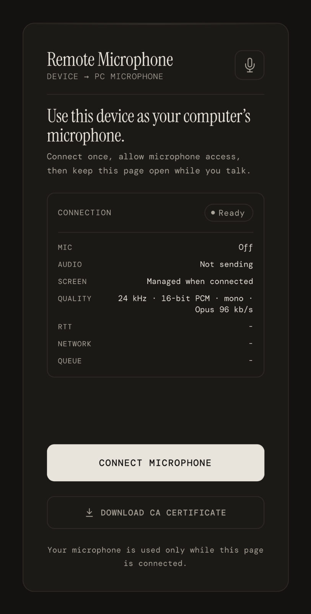
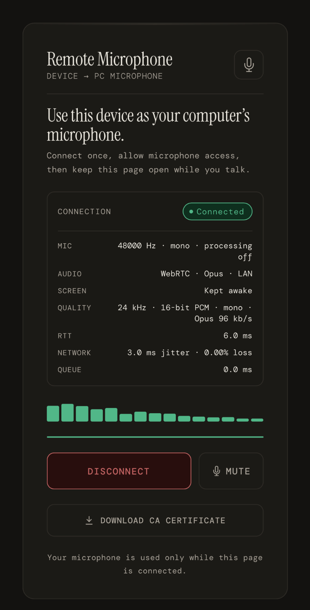
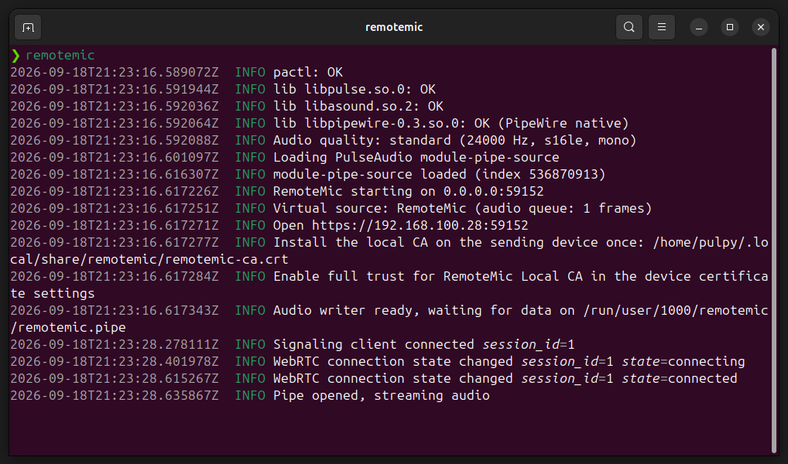
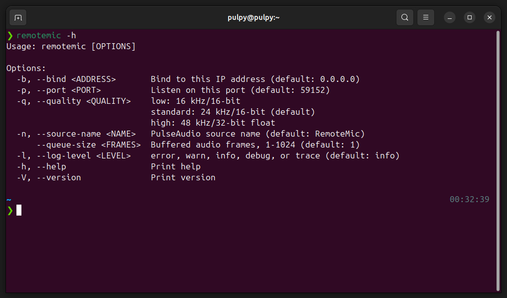
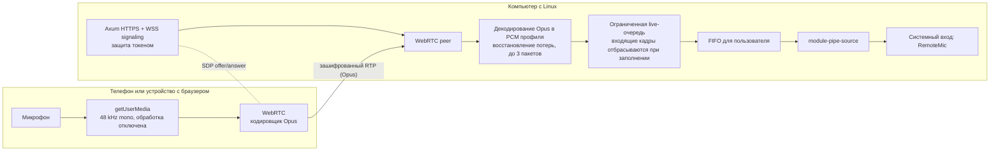

<div align="center">

# 🎙️ RemoteMic

<p><b>Используйте телефон или другое устройство с браузером как виртуальный микрофон в реальном времени на компьютере с Linux</b></p>

[](https://www.rust-lang.org/)
[](https://github.com/tokio-rs/axum)
[](https://webrtc.org/)
[](https://www.freedesktop.org/wiki/Software/PulseAudio/)
[](https://github.com/goldpulpy/RemoteMic/actions/workflows/ci.yml)
[](LICENSE)

[English](README.md) · [Русский](README.ru.md)

[🚀 Быстрый старт](#quick-start) · [🎚 Качество аудио](#audio-quality) · [🛠 Установка](#installation) · [🔒 Безопасность](#security-model) · [❓ Устранение неполадок](#troubleshooting) · [📄 Лицензия](#license)

</div>

RemoteMic захватывает звук в браузере, передаёт его через WebRTC с использованием Opus и
предоставляет его через PulseAudio или режим совместимости PipeWire Pulse как системный вход
с именем **RemoteMic**. Такие приложения, как OBS, Discord, DAW или браузер, могут
выбрать его как обычный микрофон.

RemoteMic предоставляет собственный HTTPS-интерфейс с постоянным локальным
самоподписанным центром сертификации, поэтому внешний туннель не требуется, если оба устройства
находятся в одной сети.

<p align="center">
  
  &nbsp;&nbsp;
  
</p>

<details>
<summary><strong>Показать командную строку</strong></summary>

<p align="center">
  
  
</p>

</details>

## ✨ Основные возможности

- Передача аудио через WebRTC (Opus): браузер кодирует, сервер декодирует в PCM
- Встроенный HTTPS с постоянным локальным CA; в LAN туннель не нужен
- Профили низкого, стандартного и высокого качества, соответствующие разным битрейтам Opus
- Совместимость с PulseAudio и PipeWire Pulse
- Одновременно активен только один отправитель, что предотвращает смешивание сессий
- Ограниченная очередь реального времени, сдерживающая рост буфера и задержки
- Отображение RTT, джиттера, потерь пакетов и метрик очереди на странице в реальном времени
- Один бинарный файл Rust со встроенным веб-интерфейсом

<a id="audio-quality"></a>

## 🎚️ Качество аудио

RemoteMic имеет три профиля качества:

| Профиль    | Частота выхода сервера | Формат Pulse | Битрейт Opus | Рекомендуемое применение                       |
| ---------- | ---------------------: | ------------ | -----------: | ---------------------------------------------- |
| `low`      |              16,000 Hz | `s16le`      |      48 kb/s | речь при медленном или ограниченном соединении |
| `standard` |              24,000 Hz | `s16le`      |      96 kb/s | речь, звонки, обычное использование            |
| `high`     |              48,000 Hz | `float32le`  |     192 kb/s | озвучка и стриминг в 48 kHz                    |

<details>
<summary><strong>Что означают эти форматы и что гарантирует "высокое качество"</strong></summary>

Значения битрейта Opus описывают закодированный поток между браузером и
RemoteMic. Они не включают накладные расходы WebRTC, DTLS и IP. Все режимы работают
в моно, поскольку браузерный захват микрофона обычно предоставляет один канал.

Браузер всегда захватывает звук с частотой 48 kHz и кодирует его в Opus с выбранным
битрейтом. Сервер декодирует этот поток в выходную частоту выбранного профиля и
записывает PCM либо в знаковом 16-битном little-endian (`s16le`), либо в 32-битном
float little-endian (`float32le`) формате в pipe-источник PulseAudio.

Opus - кодек с потерями. Режим low сохраняет диапазон частот, важный для речи, при этом
снижая сетевой трафик примерно на 50% по сравнению со standard и на 75%
по сравнению с high. Он предназначен для речи, а не для музыки или высококачественной
записи.

Профиль высокого качества декодирует звук в `float32le` при 48 kHz - частоте, обычно
используемой телефонами и программами для работы с видео, - и позволяет избежать
преобразования RemoteMic из float в 16-битный формат. Это не гарантирует побитовый
доступ к аппаратному микрофону телефона: устройство, операционная система или браузер
могут применять обработку до того, как сигнал попадёт в Web Audio, а при передаче
сигнал всё равно кодируется Opus.

RemoteMic запрашивает отключение браузерного эхоподавления, шумоподавления и
автоматической регулировки усиления. Браузеры могут проигнорировать эти ограничения.
Страница предупреждает, если фактическая частота дискретизации или флаги обработки
отличаются от запрошенных.

</details>

## ⚙️ Как это работает

<details>
<summary><strong>Показать архитектуру и путь аудио в реальном времени</strong></summary>



Путь данных:

1. При запуске RemoteMic создаёт или загружает постоянный локальный CA и
   сертификат сервера, затем загружает `module-pipe-source` PulseAudio. Пользователи
   PipeWire получают тот же интерфейс через `pipewire-pulse`.
2. Модуль считывает выбранный монофонический PCM-формат из FIFO и публикует
   источник **RemoteMic**.
3. Встроенная страница открывает защищённый токеном WebSocket и обменивается WebRTC
   offer и answer. Используются только локальные (LAN) ICE-кандидаты host-типа,
   поэтому оба устройства должны быть доступны друг другу в одной сети.
4. Браузер захватывает моно-аудио 48 kHz, запрашивает отключение эхоподавления,
   шумоподавления и автоматической регулировки усиления и кодирует Opus с выбранным
   битрейтом.
5. Сервер получает зашифрованный RTP-поток, декодирует Opus, восстанавливает до
   трёх потерянных пакетов и преобразует результат в PCM-формат выбранного профиля.
6. Сервер передаёт кадры текущей сессии в FIFO, не применяя собственные
   кодеки, усиление, фильтрацию или микширование.

FIFO хранится в `$XDG_RUNTIME_DIR/remotemic`, если переменная доступна; в противном
случае RemoteMic использует `$TMPDIR/remotemic-<uid>`. Локальный CA сохраняется между
перезагрузками в `~/.local/share/remotemic`. Оба каталога приложения создаются с
правами `0700`, а закрытый ключ CA записывается с правами `0600`.

### ⏱️ Поведение в реальном времени

RemoteMic спроектирован как живой микрофон, а не как рекордер без потерь. По умолчанию
сервер использует очередь из одного аудиокадра. Если выход не успевает обрабатывать
данные, самый старый кадр в очереди заменяется самым новым. Это не даёт задержке
расти бесконечно, но серьёзные сетевые или системные зависания могут приводить
к слышимым пропускам.

Статистика WebRTC передаёт RTT на страницу, а сервер отслеживает джиттер, потери
пакетов и задержку очереди. Страница опрашивает `/metrics` раз в секунду и отображает
все четыре значения.

</details>

## 📋 Требования

<details>
<summary><strong>Показать системные требования и требования к браузеру</strong></summary>

### 🐧 Компьютер с Linux

- Linux
- PulseAudio или PipeWire с `pipewire-pulse`
- `pactl`, обычно предоставляемый пакетом `pulseaudio-utils` или клиентским пакетом
  PulseAudio вашего дистрибутива
- `libpulse.so.0` и `libasound.so.2`

### 📱 Отправляющее устройство

- Современный браузер с поддержкой `getUserMedia`, Web Audio и WebRTC
- Разрешение на использование микрофона
- Локальный CA RemoteMic, установленный как доверенный корневой сертификат (скачивается со страницы)
- Сетевая доступность уровня 3 до компьютера, обычно одна LAN или VPN

Для работы в одной сети публичный туннель или подключение к интернету не требуются.

</details>

<a id="installation"></a>

## 📦 Установка

<details open>
<summary><strong>Установить готовый бинарный файл</strong></summary>

Скачайте последнюю версию бинарного файла:

```bash
curl -L https://github.com/goldpulpy/RemoteMic/releases/download/latest/remotemic -o remotemic
chmod +x remotemic
sudo mv remotemic /usr/local/bin/remotemic
```

Через `wget`:

```bash
wget https://github.com/goldpulpy/RemoteMic/releases/download/latest/remotemic
chmod +x remotemic
sudo mv remotemic /usr/local/bin/remotemic
```

</details>

<details>
<summary><strong>Собрать из исходников</strong></summary>

Проект использует Rust edition 2024. Обычная нативная сборка:

```bash
git clone https://github.com/goldpulpy/RemoteMic.git
cd RemoteMic
cargo build --release
./target/release/remotemic --help
```

Чтобы получить статически слинкованный артефакт `x86_64-unknown-linux-musl`,
настроенный в Makefile, установите Rust target для musl, toolchain musl и `objcopy`,
затем выполните:

```bash
rustup target add x86_64-unknown-linux-musl
make release
./target/x86_64-unknown-linux-musl/release/remotemic --help
```

</details>

## ⌨️ Параметры командной строки

<details>
<summary><strong>Показать полную справку CLI и примеры</strong></summary>

```text
Usage: remotemic [OPTIONS]

Options:
  -b, --bind <ADDRESS>       Bind to this IP address (default: 0.0.0.0)
  -p, --port <PORT>          Listen on this port (default: 59152)
  -q, --quality <QUALITY>    low: 16 kHz/16-bit
                             standard: 24 kHz/16-bit (default)
                             high: 48 kHz/32-bit float
  -n, --source-name <NAME>   PulseAudio source name (default: RemoteMic)
      --queue-size <FRAMES>  Buffered audio frames, 1-1024 (default: 1)
  -l, --log-level <LEVEL>    error, warn, info, debug, or trace (default: info)
  -h, --help                 Print help
  -V, --version              Print version
```

Без аргументов RemoteMic слушает порт `59152` и использует стандартное качество:

```bash
remotemic
```

Выбрать фиксированный порт:

```bash
remotemic --port 9000
```

Включить высокое качество:

```bash
remotemic --quality high
```

Использовать профиль речи с низким потреблением трафика:

```bash
remotemic --quality low
```

Объединить обе опции:

```bash
remotemic --port 9000 --quality high
```

Слушать только локальный компьютер вместо всех сетевых интерфейсов:

```bash
remotemic --bind 127.0.0.1 --port 9000
```

Выбрать имя источника PulseAudio/PipeWire, отображаемое аудиоприложениям:

```bash
remotemic --source-name studio_mic
```

Имена источников могут содержать ASCII-буквы, цифры, `.`, `-` и `_`.

Увеличьте ограниченную аудиоочередь, если короткие задержки планировщика вызывают
пропуски. Более крупная очередь может сгладить более длительные задержки, но также
может увеличить latency:

```bash
remotemic --queue-size 32
```

Включить диагностику запуска, сессии, TLS, WebRTC, FIFO и периодической передачи аудио:

```bash
remotemic --log-level debug
```

Для событий каждого пакета и кадра используйте `trace`. Этот режим намеренно очень
подробный и лучше подходит только для коротких сеансов диагностики:

```bash
remotemic --log-level trace
```

Все параметры можно комбинировать:

```bash
remotemic --bind 0.0.0.0 --port 9000 --quality high \
  --source-name studio_mic --queue-size 32 --log-level debug
```

Показать установленную версию:

```bash
remotemic --version
```

При запуске терминал показывает выбранный аудиоформат, HTTPS URL и путь к локальному
сертификату CA. Логирование `debug` дополнительно показывает конфигурацию, стартовые
проверки, захват сессии, настройку TLS, согласование WebRTC, жизненный цикл pipe и
периодические значения количества байтов/кадров. Остановите RemoteMic через `Ctrl+C`;
он выгрузит виртуальный источник и удалит FIFO.

</details>

<a id="quick-start"></a>

## 🚀 Быстрый старт

### 1️⃣ Запустите RemoteMic

```bash
remotemic --quality high
```

Для речи по более медленной сети используйте `--quality low`. При запуске RemoteMic
выводит HTTPS URL, например `https://192.168.1.10:59152`, и путь к
`remotemic-ca.crt`.

### 2️⃣ Добавьте локальный сертификат в доверенные

Страница работает по HTTPS с сертификатом, подписанным локальным CA RemoteMic.
Отправляющее устройство должно доверять этому CA, иначе браузер может заблокировать
доступ к микрофону или отклонить соединение.

При первом посещении браузер покажет предупреждение о сертификате или конфиденциальности,
поскольку локальный CA ещё не является доверенным. Убедитесь, что URL совпадает с
локальным адресом RemoteMic, показанным в терминале, затем один раз выберите в браузере
**Дополнительно** и **Продолжить** (или **Принять риск и продолжить**).
Точная формулировка зависит от браузера.

После открытия страницы нажмите **Download CA certificate**. Либо скачайте его напрямую
с `https://<computer-ip>:59152/remotemic-ca.crt`, либо скопируйте файл из пути,
показанного при запуске. Затем импортируйте его:

<details open>
<summary><strong>Android</strong></summary>

Откройте скачанный файл `.crt` и следуйте подсказкам либо перейдите в
**Настройки → Безопасность → Шифрование и учётные данные → Установить сертификат →
Сертификат CA**, затем выберите файл.

</details>

<details>
<summary><strong>iOS / iPadOS</strong></summary>

Откройте файл `.crt`, затем перейдите в **Настройки → Профиль загружен → Установить**.
После этого включите полное доверие в
**Настройки → Основные → Об этом устройстве → Доверие сертификатам**.

</details>

<details>
<summary><strong>Браузеры на компьютере</strong></summary>

Импортируйте `remotemic-ca.crt` в хранилище доверенных корневых CA операционной системы
или браузера, затем перезапустите браузер.

</details>

После установки CA полностью закройте и снова откройте браузер. В дальнейшем тот же
адрес RemoteMic должен открываться без предупреждения о сертификате.

> [!IMPORTANT]
> Сертификат подписан CA, созданным на этом компьютере. Устанавливайте его только
> если вы контролируете компьютер, на котором работает RemoteMic, и доверяете ему.
> Закрытый ключ CA остаётся на компьютере и никогда не раздаётся сервером.

### 3️⃣ Подключите телефон

1. Откройте показанный HTTPS URL.
2. Нажмите **Connect microphone**.
3. Разрешите доступ к микрофону.
4. Оставьте страницу открытой, а телефон - активным.

**Disconnect** (при подключении кнопка переключается на **Disconnect**) останавливает
треки браузера, закрывает WebRTC-соединение и сигнальный WebSocket и позволяет
подключиться другому устройству. **Mute** временно отключает звук текущего потока,
не завершая сессию.

### 4️⃣ Выберите виртуальный микрофон

В настройках звука Linux или в приложении для записи выберите
**RemoteMic** как устройство ввода.

Проверьте наличие источника:

```bash
pactl list short sources
```

Посмотрите подробности согласованной конфигурации:

```bash
pactl list sources
```

## 🗑️ Удаление

### 🔐 Удалите сертификат с отправляющих устройств

Сертификат отображается как **RemoteMic Local CA** в хранилище доверенных сертификатов
устройства. Удалите его со всех устройств, на которых он был установлен:

<details open>
<summary><strong>Android</strong></summary>

Откройте **Настройки → Безопасность и конфиденциальность → Другие настройки безопасности →
Шифрование и учётные данные → Доверенные учётные данные**, выберите вкладку
**Пользовательские**, откройте **RemoteMic Local CA** и удалите или отключите его.
Названия пунктов меню различаются в зависимости от версии Android и производителя;
поиск в настройках по словам "учётные данные" или "сертификаты" обычно открывает
нужный экран.

</details>

<details>
<summary><strong>iOS / iPadOS</strong></summary>

Откройте **Настройки → Основные → VPN и управление устройством**, выберите профиль,
содержащий **RemoteMic Local CA**, и нажмите **Удалить профиль**. Если сертификат всё
ещё отображается в **Настройки → Основные → Об этом устройстве → Доверие сертификатам**,
отключите для него полное доверие.

</details>

<details>
<summary><strong>Браузеры на компьютере</strong></summary>

Удалите **RemoteMic Local CA** из того же хранилища сертификатов операционной системы
или браузера, куда он был импортирован. Ищите его среди доверенных корневых
сертификатов или центров сертификации, затем полностью перезапустите браузер.

</details>

### 🧹 Удалите RemoteMic из Linux

Остановите RemoteMic через `Ctrl+C`, затем удалите готовый бинарный файл,
установленный командами из этого README:

```bash
sudo rm /usr/local/bin/remotemic
```

Удалите постоянный локальный CA, его закрытый ключ и каталог данных RemoteMic:

```bash
rm -r -- "$HOME/.local/share/remotemic"
```

Если RemoteMic был собран из исходников, а не установлен в `/usr/local/bin`,
удалите клонированный репозиторий или бинарный файл, который вы копировали вручную.

> [!IMPORTANT]
> Удаление `~/.local/share/remotemic` навсегда удаляет закрытый ключ локального CA.
> Если RemoteMic будет запущен снова, он создаст новый CA, который потребуется
> заново установить на всех отправляющих устройствах.

## 🎛️ Выбор режима качества

<details>
<summary><strong>Когда использовать low, standard или high</strong></summary>

Используйте `low`, когда:

- передаётся речь, а не музыка;
- пропускная способность сети ограничена;
- режим standard приводит к потерям пакетов или предупреждениям о пропущенных кадрах;
- экономия трафика важнее детализации высоких частот.

Используйте `standard`, когда:

- микрофон используется для звонков, чата или распознавания речи;
- важен меньший расход трафика;
- соединение нестабильно;
- предпочтительна максимальная совместимость.

Используйте `high`, когда:

- вам нужна монофоническая голосовая дорожка 48 kHz (озвучка, голосовая дорожка
  для видео или стриминг);
- звук будет позже обрабатываться или микшироваться, а выход `float32le` позволяет
  избежать дополнительного преобразования;
- нужен максимально доступный битрейт Opus для голоса;
- сеть и принимающее ПО без проблем справляются с более крупным потоком.

Режим high улучшает формат внутри RemoteMic благодаря выходу 48 kHz и 32-bit float,
но не может восстановить информацию, уже потерянную телефоном, браузером или при
кодировании Opus; поток по-прежнему монофонический и с потерями. Это не замена
специализированному микрофону для записи или аудиоинтерфейсу и не предназначено как
основной источник для музыкального продакшена. Для критически важной записи также
записывайте звук локально на телефоне: локальная запись не подвержена потерям
сетевых пакетов.

</details>

<a id="security-model"></a>

## 🔒 Модель безопасности

<details>
<summary><strong>Что защищено и что становится доступным</strong></summary>

- HTTPS и DTLS-SRTP шифруют страницу, signaling и медиаданные при передаче.
- RemoteMic создаёт постоянный локальный CA и новый сертификат сервера для каждого
  запуска и отдаёт CA по `/remotemic-ca.crt` для ручной установки доверия.
- При каждом запуске сервер создаёт случайный токен сессии, встраивает его в
  обслуживаемую страницу и требует его при обновлении соединения до WebSocket.
- Одновременно передавать поток может только один WebSocket-клиент.
- Токен не заменяет контроль доступа. Любой, кто может открыть общедоступную страницу,
  может получить его и попытаться подключиться.
- Медиапуть использует только локальные ICE-кандидаты, поэтому не обращается к
  STUN- или TURN-серверам.

Локальный CA заслуживает доверия ровно настолько, насколько заслуживает доверия
компьютер, на котором он создан. Любой, кто получит закрытый ключ CA, сможет выдавать
себя за RemoteMic, поэтому храните постоянный каталог данных в приватном месте и не
копируйте ключ с компьютера. Используйте доверенную сеть, по возможности ограничивайте
доступ и не публикуйте URL. RemoteMic не хранит записи и намеренно не записывает
захваченный звук на диск.

</details>

<a id="troubleshooting"></a>

## ❓ Устранение неполадок

<details>
<summary><strong><code>pactl</code> не установлен</strong></summary>

```bash
# Ubuntu / Debian
sudo apt install pulseaudio-utils

# Fedora
sudo dnf install pulseaudio-utils

# Arch Linux
sudo pacman -S libpulse
```

</details>

<details>
<summary><strong>Отсутствуют необходимые аудиобиблиотеки</strong></summary>

```bash
# Ubuntu / Debian
sudo apt install libpulse0 libasound2

# Fedora
sudo dnf install pulseaudio-libs alsa-lib

# Arch Linux
sudo pacman -S libpulse alsa-lib
```

</details>

<details>
<summary><strong>Браузер предупреждает о сертификате или блокирует доступ к микрофону</strong></summary>

Установите `remotemic-ca.crt` как доверенный корневой CA на отправляющем устройстве
(см. [Добавьте локальный сертификат в доверенные](#2-добавьте-локальный-сертификат-в-доверенные)),
затем полностью закройте и снова откройте браузер. Сертификат охватывает `localhost`
и LAN IP, определённый при запуске; если вы обращаетесь к серверу по другому адресу
(например, VPN IP или hostname), сертификат не совпадёт. Перезапустите RemoteMic,
привязав его к этому адресу, либо добавьте адрес в hosts устройства и используйте
`localhost`.

</details>

<details>
<summary><strong>RemoteMic не отображается как устройство ввода</strong></summary>

Проверьте списки источников и модулей:

```bash
pactl list short sources
pactl list short modules
```

Перезапустите RemoteMic, убедившись, что PulseAudio или `pipewire-pulse` запущен.
Если RemoteMic ранее аварийно завершился, старый `module-pipe-source` может всё ещё
оставаться загруженным. Найдите его числовой индекс модуля во второй команде и
выгрузите конкретный индекс:

```bash
pactl unload-module <module-index>
```

Затем снова запустите RemoteMic.

</details>

<details>
<summary><strong>Страница подключается, но звука нет</strong></summary>

- Убедитесь, что **RemoteMic** выбран в принимающем приложении.
- Убедитесь, что на странице отображается **WebRTC · Opus · LAN**.
- Проверьте на странице текущие метрики RTT, джиттера и потерь пакетов.
- Убедитесь, что предоставлено разрешение для нужного микрофона.
- Убедитесь, что другое приложение не удерживает микрофон телефона в эксклюзивном режиме.
- Отключитесь, обновите страницу и подключитесь снова.

</details>

<details>
<summary><strong>Страница сообщает, что подключено другое устройство</strong></summary>

Одновременно передавать поток может только один клиент. Отключите текущее устройство
или дождитесь закрытия его WebRTC-сессии, затем подключитесь снова. Если браузер
исчез без корректного закрытия соединения, через небольшой промежуток времени
обновите страницу на ожидающем устройстве.

</details>

<details>
<summary><strong>Согласование WebRTC завершается ошибкой или соединение не переходит в connected</strong></summary>

RemoteMic использует только локальные ICE-кандидаты и не использует STUN/TURN-серверы,
поэтому два устройства должны иметь возможность напрямую связаться друг с другом.

- Убедитесь, что оба устройства находятся в одной LAN или подключены через VPN.
- Разрешите входящий UDP-трафик к компьютеру в firewall.
- Избегайте сетей с client isolation или изоляцией гостевого Wi-Fi.
- Reverse proxy или HTTP-туннель для страницы не ретранслирует WebRTC-медиа;
  для доступа вне LAN используйте VPN.
- Проверьте серверные логи с `--log-level debug` на сообщения о сборе ICE-кандидатов
  и состоянии соединения.

</details>

<details>
<summary><strong>В аудио есть пропуски, щелчки или предупреждения о пропущенных кадрах</strong></summary>

- Попробуйте `--quality low`, чтобы снизить сетевой трафик.
- Предпочитайте стабильное локальное Wi-Fi-соединение.
- Держите отправляющую страницу на переднем плане.
- Снизьте нагрузку на CPU телефона и компьютера.
- Следите на странице за ростом потерь пакетов или джиттера, а в серверных логах -
  за сообщениями о пропущенных кадрах.

RemoteMic намеренно отбрасывает входящие кадры при заполнении буферов, поэтому
перегруженное соединение приводит к пропускам, а не к постоянно растущей задержке.

</details>

<details>
<summary><strong>Режим высокого качества не работает, а standard работает</strong></summary>

Установленный PulseAudio или слой совместимости PipeWire может не принимать формат
pipe-source `float32le`. Проверьте ошибку `pactl load-module`, которую выводит
RemoteMic, и используйте `--quality standard` как совместимый запасной вариант.

</details>

## ⚠️ Текущие ограничения

<details>
<summary><strong>Показать текущие ограничения</strong></summary>

- Приёмник только для Linux
- Только монофонический захват
- Только одно активное отправляющее устройство
- Opus работает с потерями, а режим high не является bit-perfect
- Ориентация на LAN: STUN/TURN отсутствуют, поэтому для работы вне LAN требуется VPN
- Локальный CA необходимо вручную добавлять в доверенные на каждом отправляющем устройстве
- Нет UI аутентификации, записи или встроенного туннеля
- Ограничения браузерного аудио - это запросы, а не аппаратные гарантии
- При backpressure аудиокадры могут отбрасываться для сохранения низкой live-задержки

</details>

## 💻 Разработка

<details>
<summary><strong>Показать структуру проекта и команды разработки</strong></summary>

Структура проекта:

```text
src/main.rs       CLI parsing, startup, shutdown, and FIFO writer
src/audio.rs      audio presets and PulseAudio virtual-source lifecycle
src/server.rs     HTTPS/WebSocket signaling, WebRTC, Opus decode, session state
src/tls.rs        persistent local CA and per-run HTTPS certificate
src/page.rs       embedded browser UI, WebRTC client, and metrics
src/preflight.rs  pactl and shared-library checks
```

Полезные команды:

```bash
cargo test
cargo fmt --all --check
cargo clippy --all-targets --all-features -- -D warnings
make release
make security
```

WebSocket используется только для signaling и ограничивает сообщения и кадры размером
256 KiB. Аудио передаётся через WebRTC и не подпадает под это ограничение.

</details>

<a id="license"></a>

## 📄 Лицензия

Лицензия MIT - см. [LICENSE](LICENSE).
